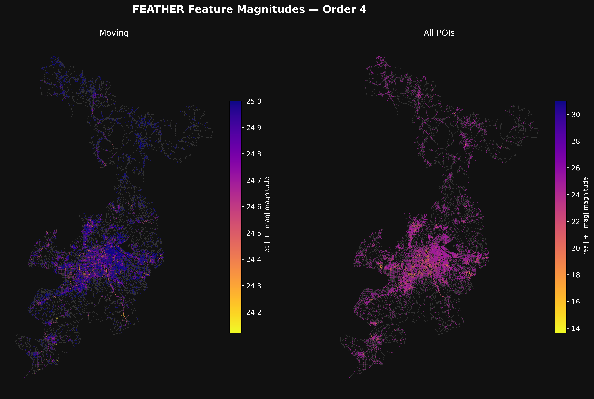

This repository contains a research oriented project exploring **accessibility analysis based on the 15-minute city concept**, with a focus on comparing traditional accessibility approched with a FEATHER based approch.

## Problem Statement

The **15-minute city** is an urban planning concept introduced by Carlos Moreno in 2016. It describes a city where residents can access all essential daily services such as work, education, healthcare, shopping, and social activities within a **definitive walking distance** from their home.

The concept emphasises:

- Improved **accessibility**
- Reduced **dependence on cars**
- Increased **social equity**, regardless of mobility or socioeconomic status

In this project, accessibility is defined as the **ability to reach essential services and amenities within a given threshold**, which serves as a continuous value rather than a strict cutoff.

## Project Goal

The goal of this project is to explore and evaluate **new methods for urban accessibility analysis** by leveraging modern graph algorithms specifically the **FEATHER algorithm** and comparing them with established tools such as **GOAT (Geo Open Accessibility Tool)**.

The project aims to deliver a **FEATHER-based solution** capable of processing **OpenStreetMap (OSM)** data to produce accessibility analyses comparable to GOAT’s current capabilities.

## Research Objectives

1. **Comparative Analysis**
   Analyze FEATHER and GOAT for accessibility mapping, focusing on strengths, limitations, and practical differences through case studies or scenarios.

2. **Performance Evaluation**
   Evaluate FEATHER’s performance, robustness, and accuracy when calculating accessibility metrics within an urban environment.

3. **Methodological Extensions**
   Explore potential extensions to existing accessibility measurement methodologies that could be implemented using FEATHER.

## Methodology Overview

- Utilize **OpenStreetMap (OSM)** data as the primary spatial data source
- Apply the **FEATHER algorithm** for graph-based accessibility analysis
- Compare outputs and metrics against those produced by **Pandana**
- Document implementation details, assumptions, and limitations

## Expected Deliverables

- A FEATHER-based accessibility analysis
- Detailed documentation of the methodology and implementation
- Comparative results between FEATHER and PANDANA
- Discussion of limitations and future improvements

## How to run codebase Examples

This example demonstrates how to generate accessibility graph summaries for Daegu, South Korea using OpenStreetMap data.

```bash
#1. Clone the Repository
git clone https://github.com/MRollin03/FGSAM-FEATHER-Graph-summaries-of-accessibility-maps.git

#2. Navigate to the Utility Scripts
cd FGSAM-FEATHER-Graph-summaries-of-accessibility-maps/src/Utils

#3. Run the OSM to Feather Converter
# The following command downloads and processes map data for Daegu, South Korea and stores the generated project files in the projects directory.


```

If you are having trouble with the module utils not getting reconized/found write this command into the terminal
```bash
  # make current terminal's python session reconize your internal modules
  export PYTHONPATH=$PYTHONPATH:$(pwd)/FEATHER/src
```

>[!NOTE]
>Ensure you have Python and all required dependencies installed before running the script.
>Internet access is required to fetch OpenStreetMap data.
>Large locations may take additional processing time depending on system performance. and Overpass API status


## User Guide

### Automation.sh and or OSM2FeatherConverter.py

`OSM2FeatherConverter.py` handles the full OSM processing pipeline, including querying OpenStreetMap data through the Overpass API, formatting the data, computing FEATHER metrics, and generating plots. But a eaiser way of using it and get a overview would be using the Automation.sh scripts in the Utils directory. src/Utils/Automation.sh

 

Pipeline overview:

```
Input → Overpass API → Formatting → FEATHER Computing → Plotting
```
Run the whole pipine with the bash script
You can edit diffrent parameters easily in the script
```bash
bash Automation.sh
```

### Arguments

```bash
--title STR
    Name of the project.

--type STR
    Input mode:
    PLACE        #Use a single place name
    BBOX         #Use a bounding box
    MULTI_PLACE  #Use multiple place names

--bbox FLOAT FLOAT FLOAT FLOAT
    #Bounding box coordinates:
    #west south east north
    #Only used when --type BBOX

--place STR
    #Name of a single location/place.
    #Only used when --type PLACE

--places STR [STR ...]
    #Multiple locations/place names.
    #Only used when --type MULTI_PLACE

--solo STR
    #Process only a single feature/category.
    #If NONE, all categories are processed.

--distance INT
    #Maximum distance used when searching for POIs/Amenities.

--output STR
    #Output directory for the generated project folder.

--pandana BOOL
    #Enable or disable Pandana network calculations.

--order INT
    #FEATHER order value.

--plotorders STR
    #Comma-separated list of plot orders to generate.
    #Example:
    #"1,2,3,4"

--thetamax FLOAT
    #Maximum theta value used in FEATHER calculations.

--evalpoints INT
    #Number of evaluation points used during computation.
```

### Example Usage

#### PLACE mode

```bash
python OSM2FeatherConverter.py \
    --type PLACE \
    --place "Odense Municipality" \
    --title "example_project"
```

#### BBOX mode

```bash
python OSM2FeatherConverter.py \
    --type BBOX \
    --bbox 12.24358 55.91420 12.34091 55.95679 \
    --title "example_project"
```

#### MULTI_PLACE mode

```bash
python OSM2FeatherConverter.py \
    --type MULTI_PLACE \
    --places \
        "Copenhagen Municipality, Denmark" \
        "Frederiksberg Municipality, Denmark" \
    --title "example_project"
```


The options for FEATHER can be found here: https://github.com/benedekrozemberczki/FEATHER/blob/master/README.md

### Graphs
OSM to feather conversion pipeline


## Literature

- Moreno, C. (2021). _Definition of the 15-minute city: What is the 15-minute city?_
  [https://www.researchgate.net/publication/362839186_Definition_of_the_15-minute_city_WHAT_IS_THE_15_MINUTE_CITY](https://www.researchgate.net/publication/362839186_Definition_of_the_15-minute_city_WHAT_IS_THE_15_MINUTE_CITY)

- OpenStreetMap Contributors. _Planet OSM._
  [https://planet.osm.org/](https://planet.osm.org/) (Accessed: 26-01-2026)

- Rozenberczki, B., & Sarkar, R. (2020). _Characteristic Functions on Graphs: Birds of a Feather, from Statistical Descriptors to Parametric Models._
  arXiv:2005.07959, [https://arxiv.org/pdf/2005.07959.pdf](https://arxiv.org/pdf/2005.07959.pdf) (Accessed: 26-01-2026)

## License

This project is intended for academic and research purposes. Licensing details will be added  once finalised.


